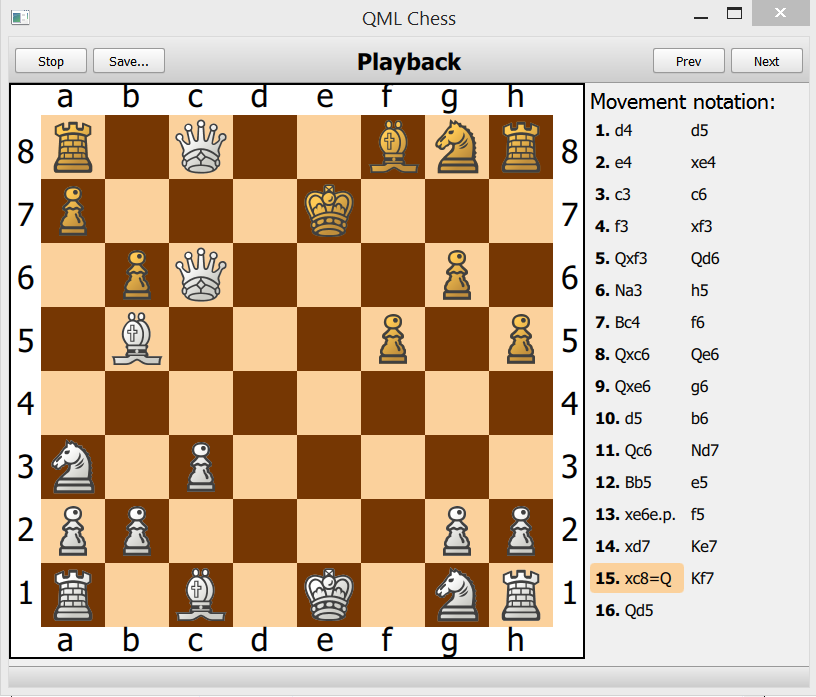

Description
-----------
Another one local multiplayer chess game
...reinventing the wheel

Features
--------
  - Dran-n-Drop + Click-by-Click movements
  - Save/Load game move history
  - Game Playback
  - Available moves indication
  - En passant
  - Pawn promotion
  - Algebraic notation

Technics
--------
  - QML(GUI) + QT(logic)
  - Dynamic qml component creation
  - JSon serialization
  - QsharedPointers list qml model binding

Some screens
------------

